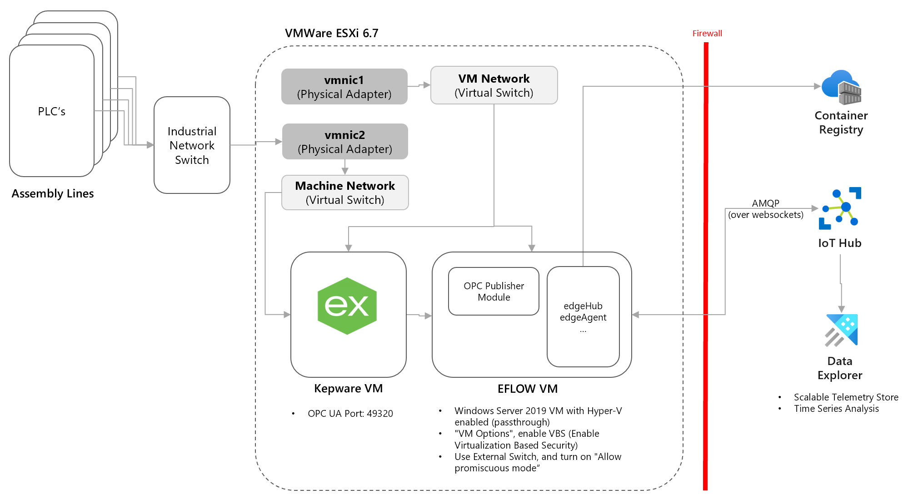
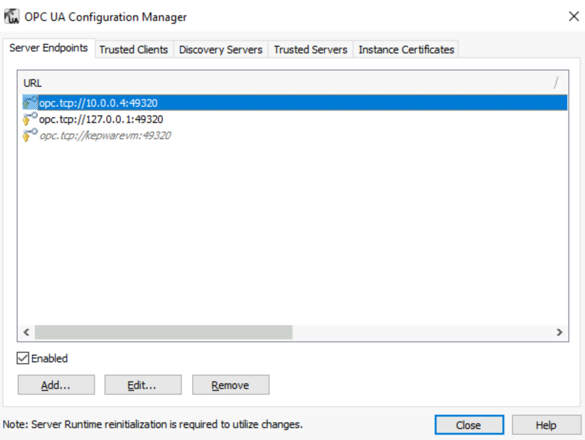
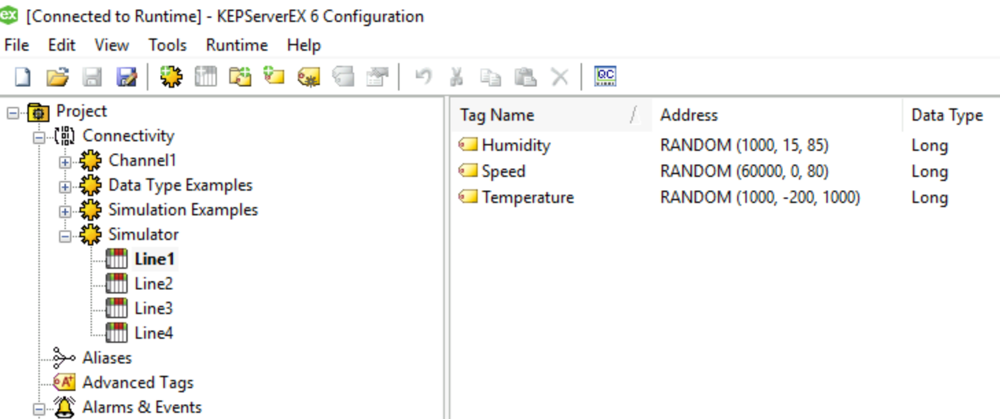
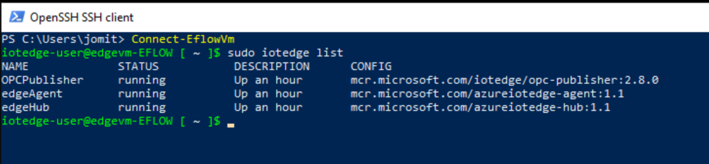
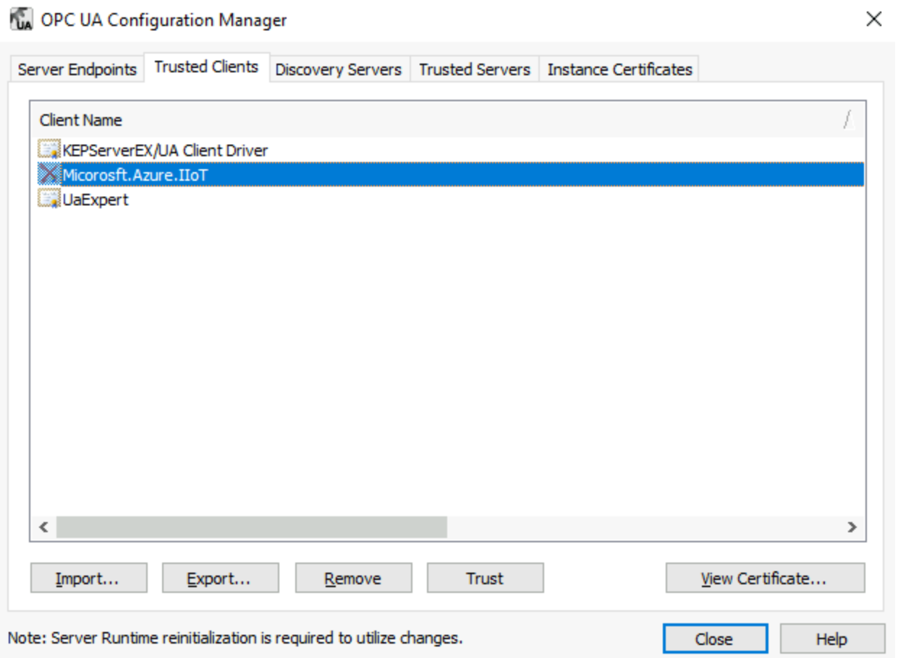
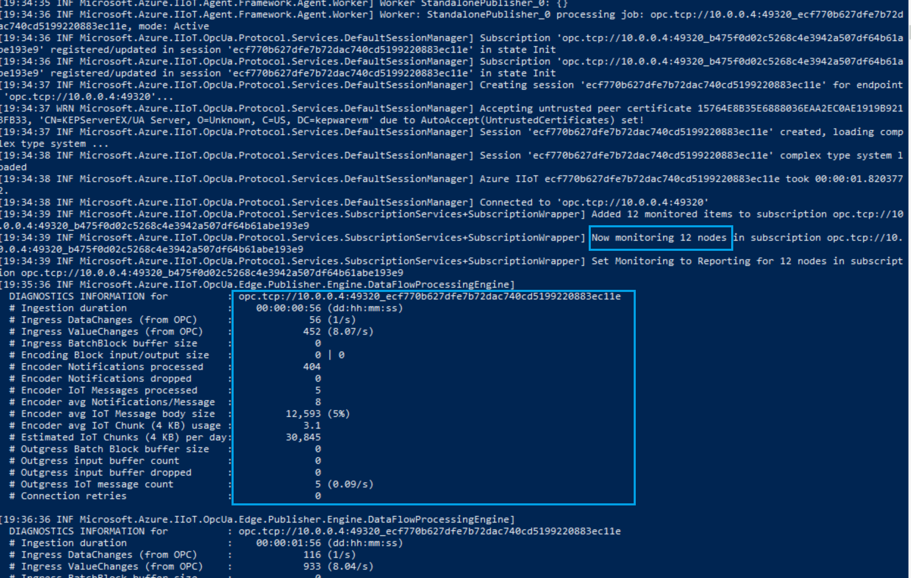
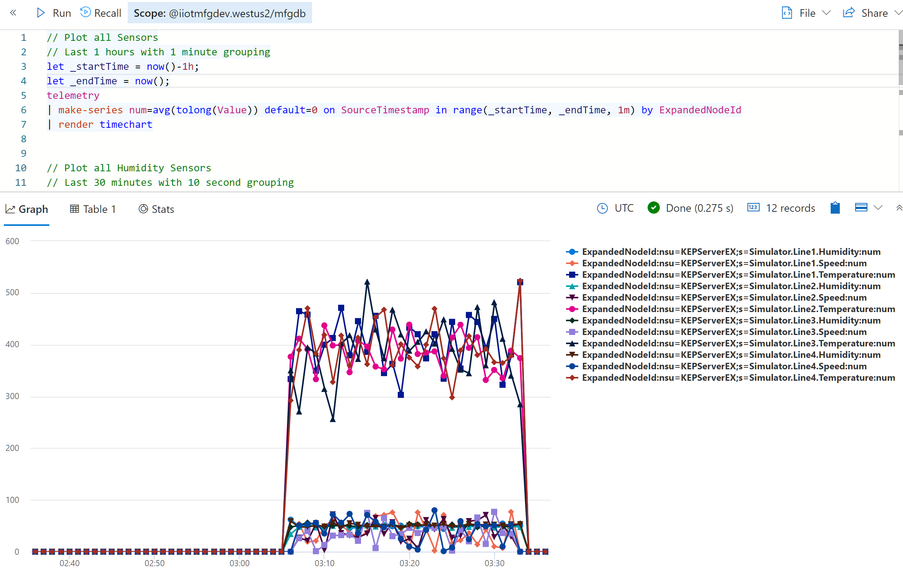
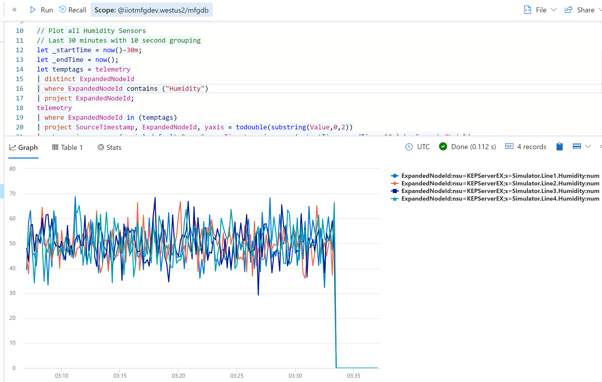

# Connectivity with Industrial Assets using OPC UA and Edge for Linux on Windows (EFLOW)

Goal of this sample is to acceleratre deployment of [Industrial IoT Connectivity Patterns](https://docs.microsoft.com/en-us/azure/architecture/guide/iiot-patterns/iiot-connectivity-patterns). There is no one size fits all solution, as there are many considerations, please review them before moving your workload to production.

Using virtualization platform is common for managing Industrial PC's in a factory floor. In this sample we will use Azure as our virtualization platform and deploy our "edge" infrastructure. Although the process and scripts provided here have been tested with other platforms as well.

## High Level Design

## Pre-requisites

- PLC's have ethernet modules and are connected to factory network.

- PLC layer and the Edge layer communication path has been established and approved.

- Industrial connectivity software supports OPC UA.

- Azure Subscription

- [Azure CLI](https://docs.microsoft.com/en-us/cli/azure/install-azure-cli?view=azure-cli-latest)

## **Industrial Connectivity Software**

*For this sample we are using KepwareEX as our industrial connectivity software, although there are many other providers that support OPC UA.*

**Create Virtual Machine**

- `az login`

- `az group create --name iiotsample --location westus2`

- `az vm create --resource-group iiotsample --name kepwarevm  --image Win2019Datacenter --public-ip-sku Standard --admin-username azureuser`

**Install KepwareEX**

- Download [KepServerEx Demo](https://www.kepware.com/en-us/products/kepserverex/) and install using default settings.

- Make sure to remember the password, as we will need this later.

**Configure KepServerEx**

- After installation, right click on KepServerEx on the System Tray.  
- Click `OPC UA Configration Manager` in KepWare Administration.
- Enter Credentials. Username is 'Administrator'. Password is what was entered during installation.
- On the **Server Endpoints** tab, click `Add` and add a new endpoint `opc.tcp://<PrivateIP>:49320` and make sure its enabled as illustrated below.

    
    

- Close the `OPC UA Configration Manager`.
- Right click again on KepServerEx on the System Tray and click `Configuration`.
- On the File Menu bar, Click 'Open'.
- Select [LineSimulationDemo.json](LineSimulationDemo.json) (You will need this file installed locally on the Windows Machine). 
- On the left panel, Navigate to Project -> Connectivity -> `Simulator`. You will see 4 lines, each with 3 tags as illustrated below.

     
    

**Configure Firewall**

- `New-NetFirewallRule -DisplayName "Allow EdgeVM to connect to KepServer" -Direction Inbound -LocalPort 49320 -Protocol TCP -Action Allow`

## **IoT Edge Gateway**

For this sample we are using [Azure IoT Edge for Linux on Windows (EFLOW)](https://docs.microsoft.com/en-us/windows/iot/iot-enterprise/azure-iot-edge-for-linux-on-windows), as it supports running containerized Linux workloads alongside Windows applications. Most manufacturing environments are familiar with managing Windows infrastructure and this enables customers to run production Linux-based cloud-native workloads on Windows. 

**Create Edge Device**

*We will create a single IoT Hub, with single edge device using Symmetric key attestation. However we can provision multiple edge gateways at scale [using Device Provisioning Service along with X.509 certificate attestation.](https://docs.microsoft.com/en-us/azure/iot-edge/how-to-provision-devices-at-scale-linux-on-windows-x509?view=iotedge-2020-11&tabs=powershell%2Cindividual-enrollment) 
We can also [restrict network level access to IoT Hub](https://docs.microsoft.com/en-us/azure/iot-hub/iot-hub-public-network-access) to enhance the device communication security*

- `az iot hub create --location westus2 --resource-group iiotsample --name iiotmfghub --sku S1`

- `az iot hub device-identity create -n iiotmfghub -d edgevmdevice --ee`

- `az iot hub device-identity connection-string show -n iiotmfghub -d edgevmdevice`
    - *copy the edge connection string as we will need this later*

**Create Edge Virtual Machine**

*For this sample we will create the edge gateway VM in the same network as the Kepware VM, although you can create these VMs in different networks. If they are in different networks you will need to configure firewall to allow 49320 for OPC communication.
Since EFLOW uses nested virtualization make sure to use the appropriate size as show [here](https://docs.microsoft.com/en-us/azure/virtual-machines/acu)*

- `az vm create --location westus2 --resource-group iiotsample --name edgevm  --image Win2019Datacenter --size Standard_D2s_v3 --public-ip-sku Standard --admin-username jomit --vnet-name kepwarevmVNET --subnet kepwarevmSubnet`

**Install EFLOW**

> [!NOTE]
> - Try new [EFLOw Auto Deploy](https://github.com/Azure/iotedge-eflow/tree/main/eflowautodeploy) Script.

*Login into the Edge VM and install EFLOW using the following powershell scripts. For more details refer to the docs [here](https://docs.microsoft.com/en-us/azure/iot-edge/how-to-provision-single-device-linux-on-windows-symmetric?view=iotedge-2020-11&tabs=azure-portal%2Cpowershell). Copy all the files from this folder to a directory in the Edge Virtual Machine as we will need them later.*

- Run [01_Install_Features.ps1](01_Install_Features.ps1) - This file installs Hyper-V and enables the feature VirtualMachinePlatform. It's a prerequisite for running nested virtualization needed for EFLOW.

- Run [02_Create_VirtualSwitch.ps1](02_Create_VirtualSwitch.ps1) - This file configures Virtual Switch and DHCP. It's a prerequisite for running EFLOW on Windows Server 2019.

- Run [03_Install_EFLOW.ps1](03_Install_EFLOW.ps1) - This file deploys IoT Edge Runtime, deploys the EFLOW VM, and configures it with the IoT Hub edge device created above.

**Configure OPCPublisher Module**

*[OPC Publisher](https://github.com/Azure/Industrial-IoT/blob/main/docs/modules/publisher.md) is an open source module from microsoft that runs on Azure IoT Edge and bridges the gap between industrial assets and the Microsoft Azure cloud. It connects to OPC UA server systems and publishes telemetry data to Azure IoT Hub in various formats, including IEC62541 OPC UA PubSub standard format.*

- Update the `EndpointUrl`, `OpcAuthenticationUsername` and `OpcAuthenticationPassword` in the [opcconfig.json](./opcconfig.json) file.

- Run [04_Copy_OPCConfig.ps1](04_Copy_OPCConfig.ps1) - This script copies the opc config json file  (opcconfig.json) from the host Windows Sserver 2019 to the nested EFLOW vm. Run this on the Edge Virutal Machine.

**Deploy OPCPublisher Module in Edge Device**

- `az iot edge set-modules --device-id edgevmdevice --hub-name iiotmfghub --content ./moduleContent.json`

**Validate Deployment in Edge Virtual Machine, using PowerShell**

- `Connect-EflowVm`

- `sudo iotedge list`

    

- `sudo iotedge logs OPCPublisher`

- *The OPCPublisher logs should show a certificate error, which we will fix in the next step.*

**Trust the IoT Edge Certificate in Kepware VM**

- Open `OPC UA Configration Manager` in KepWare Administration.

- Click on `Trusted Clients`, selected the `Microsoft.Azure.IIoT` certificate and click `Trust`

    

- Click `Reinitialize` in Kepware Adminstration

**Validate OPC Publisher in Edge Virtual machine, using PowerShell**

- `Connect-EflowVm`

- `sudo iotedge restart OPCPublisher`

- `sudo iotedge logs OPCPublisher`
    
    

## **Data Exploration**

*The key next step after connetivity is to store the device telemetry data long term, so we can can perform analyatics on it including time series analysis, forecasting, machine learning modeling, etc., to make better business decisions and get value from our data. For this sample we will use Azure Data Explorer as our long term data store for doing time series analysis as well as build near real-time dashboards.*

**Add Kusto extension to Azure CLI**

- `az extension add -n kusto`
 
**Create Data Explorer Cluster**

*For this sample we will create a 2 node cluster with Standard_E2a_v4 size, which is optimized for heavy compute to handle high throughput stream ingestion, and time series analysis on millions of telemetry messages. See [pricing details](https://azure.microsoft.com/en-us/pricing/details/data-explorer/) to estimate montly costs with other sku's.*
*It can take upto *

- `az kusto cluster create --name "iiotmfgdev" --location "westus2" --enable-streaming-ingest true --sku name="Standard_E2a_v4" capacity=2 tier="Standard" --resource-group "iiotsample"`

**Create Database**

*For this sample we will create a database with 365 days of retention and 31 days of cache. For time series analysis this means we can query and analyze last 1 year's worth data, and the queries will be much faster for last 31 days of data. We can always change this as per our needs.*

- `az kusto database create --cluster-name iiotmfgdev --database-name mfgdb --resource-group iiotsample --read-write-database soft-delete-period=P365D hot-cache-period=P31D location=westus2`

**Create Tables**

- Go to the Data Exlorer Database on the Azure Portal and open the Web UI
- Run the queries in [SetupDataExplorer.kql](./SetupDataExplorer.kql)

**Create IoT Hub Connection**

- `az iot hub consumer-group create --hub-name iiotmfghub --name adx-mfgdb --resource-group iiotsample`

- Add new [data connection for IoT Hub](https://docs.microsoft.com/en-us/azure/data-explorer/ingest-data-iot-hub#connect-azure-data-explorer-table-to-iot-hub)
	- get the iot hub resouce id `az iot hub show --name iiotmfghub` and use it for the next command; the id is in the form of 
	
		`/subscriptions/<your subscription id>/resourceGroups/iiotsample/providers/Microsoft.Devices/IotHubs/iiotmfghub`
	- `az kusto data-connection iot-hub create --cluster-name iiotmfgdev --data-connection-name iiotmfghub-connection --database-name mfgdb --resource-group iiotsample --consumer-group adx-mfgdb --shared-access-policy-name iothubowner --data-format MULTIJSON --iot-hub-resource-id /subscriptions//resourceGroups/iiotsample/providers/Microsoft.Devices/IotHubs/iiotsamplehub --table-name opcua_raw --mapping-rule-name opcua_mapping`

**Explore the Data**

- Wait for few minutes and run the queires from [BasicQueries.kql](./BasicQueries.kql) file

    

    

- If the data does not appear, try these options:

    - `Reinitialize` the KepwareEX as the demo server stops after 2 hrs.

    - Check logs for `OPCPublisher` module using [Troubleshooting in Azure Portal](https://docs.microsoft.com/en-us/azure/iot-edge/troubleshoot-in-portal?view=iotedge-2020-11#:~:text=1%20Sign%20in%20to%20the%20Azure%20portal%20and,there%2C%20you%20can%20select%20Troubleshoot%20from%20the%20menu.)

    - Run `.show ingestion failures` in Data Explorer Web UI

    - Restart both Edge and Kepware VM's

## Additional Resources

- [Production Deployment Checklist](https://docs.microsoft.com/en-us/azure/iot-edge/production-checklist?view=iotedge-2020-11)

- [Monitoring IoT Edge devices](https://docs.microsoft.com/en-us/azure/iot-edge/how-to-collect-and-transport-metrics?view=iotedge-2020-11&tabs=iothub)

