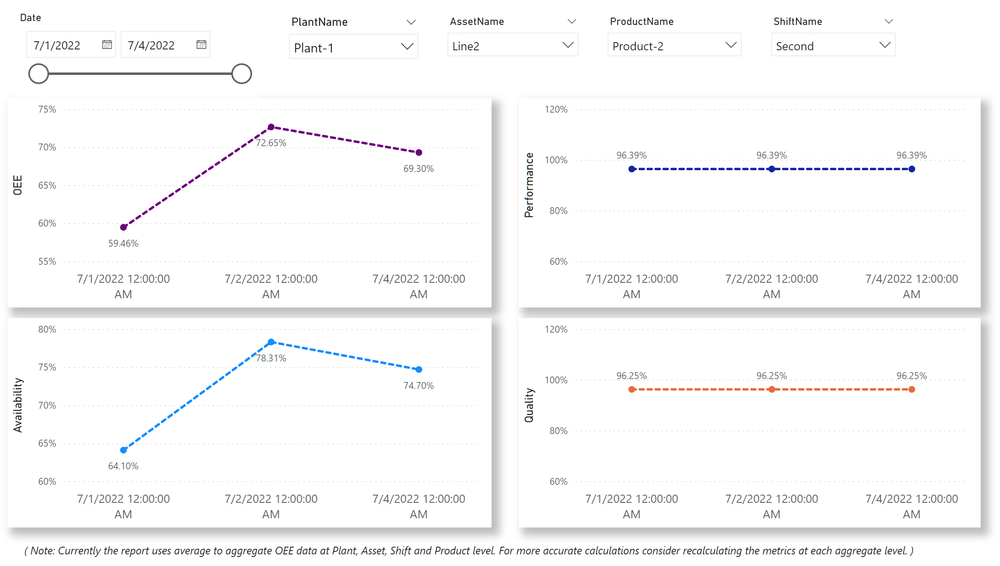

# Overall Equipment Effectiveness(OEE) and KPI Calculation Engine

Goal of this sample is to acceleratre deployment of [Industrial IoT Transparency Patterns](https://docs.microsoft.com/en-us/azure/architecture/guide/iiot-patterns/iiot-transparency-patterns). There is no one size fits all solution, as there are many considerations, please review them before moving your workload to production.

## High Level Design

## Pre-requisites

- You have [Operational Visibility](../2_OperationalVisibility/README.md) sample working.

## Setup SQL Database

- Create a [Single SQL Database](https://learn.microsoft.com/en-us/azure/azure-sql/database/single-database-create-quickstart?view=azuresql&tabs=azure-cli) using the following az cli commands:  
    1. Create a SQL server:  
         `az sql server create --name iiotsamplesqlserver  --resource-group iiotsample  --location "West US 2" --admin-user azureuser --admin-password <password>`  
    1. Configure the firewall  
            `az sql server firewall-rule create --resource-group iiosample --server iiotsamplesqlserver -n AllowYourIp --start-ip-address 0.0.0.0 --end-ip-address 0.0.0.0`  
    1. Create the database  
            `az sql db create --resource-group iiotsample --server iiotsamplesqlserver --name iiotsamplesqldb --sample-name AdventureWorksLT --edition GeneralPurpose  --compute-model Serverless --family Gen5 --capacity 2`

- Run the [sqldb/mes-reporting.sql](sqldb/mes-reporting.sql) script to create the MES and OEE Reporting tables, along with some sample data

## Setup Synapse Workspace

- Create a [Synapse Workspace](https://docs.microsoft.com/en-us/azure/synapse-analytics/quickstart-create-workspace) with default settings. 

- Create 2 [Linked Services](https://docs.microsoft.com/en-us/azure/data-factory/concepts-linked-services?tabs=data-factory) in Synapse Workspace connected to:

    1. [SQL Database](https://docs.microsoft.com/en-us/azure/data-factory/connector-azure-sql-database?tabs=data-factory#create-an-azure-sql-database-linked-service-using-ui) created above
    1. [Azure Data Explorer](https://docs.microsoft.com/en-us/azure/data-factory/connector-azure-data-explorer?tabs=data-factory#create-a-linked-service-to-azure-data-explorer-using-ui) created in the prerequisites.

- Upload new Workspace package [package/dist/manufacturingmetrics-0.1.0-py3-none-any.whl](package/dist/manufacturingmetrics-0.1.0-py3-none-any.whl)  

    

- Create a new Apache Spark Pool

    

- Upload the [package/requirements.txt](package/requirements.txt) file, select the workspace package created above and click `Apply`. Wait until the packages are deployed.

    

## Calculate OEE using Synapse Notebook

- Open `Develop` tab, click on `+` and Import the [notebook/CalculateOEE.ipynb](notebook/CalculateOEE.ipynb)

- Attach the notebook to the spark cluster created above.

- In first cell, update the values for `sqldbLinkedServiceName` and `kustolinkedServiceName` as created above

- In second cell, update the `oeeDate` to a date which has telemetry data in Data Explorer.

- Run both the cells

- Open SQL Database created above and verify the data in `OEE` table

## Visualize OEE in Power BI

- Open [powerbi/oee.pbix](powerbi/oee.pbix) file and change the `Data Source settings` to connect with the SQL Database created above.

    

    

## Additional Resources 

- Update and ReBuild package
    - `cd package`
    - `pip install wheel setuptools`
    - `python setup.py bdist_wheel`
