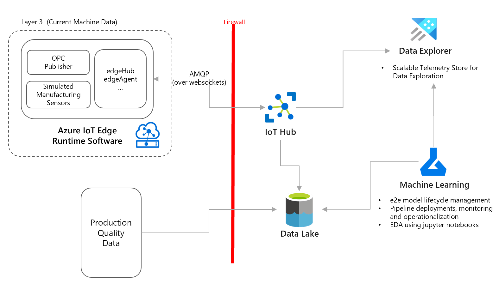
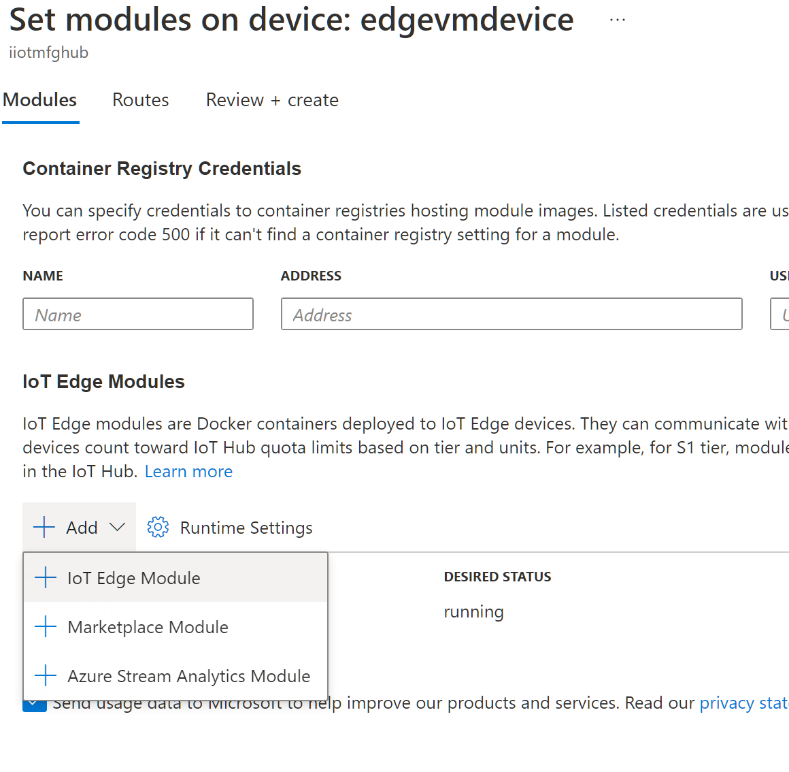
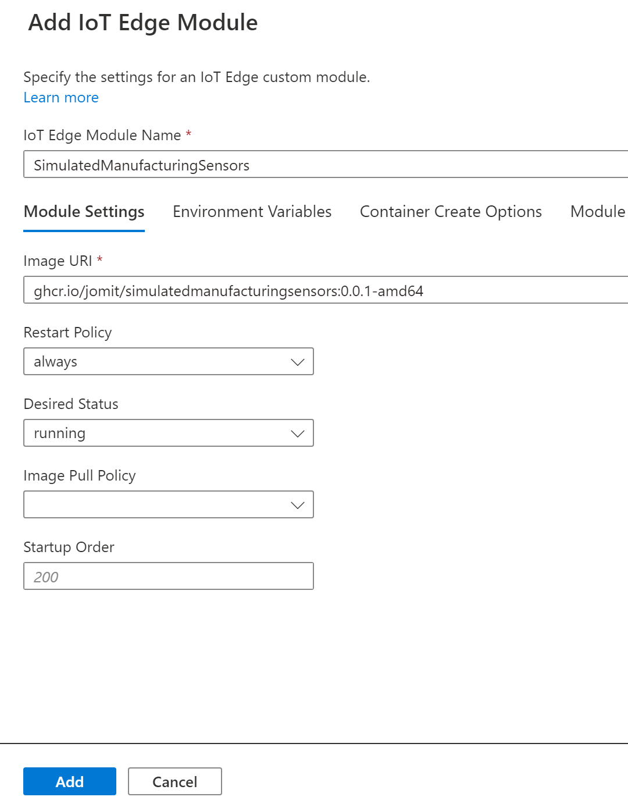
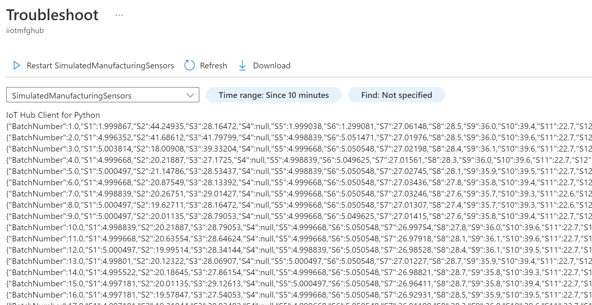
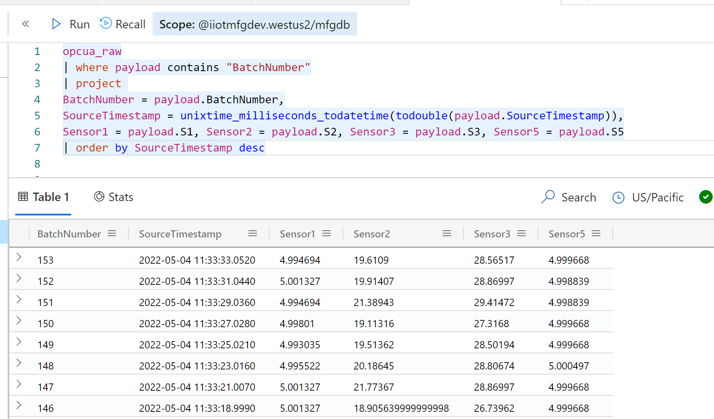
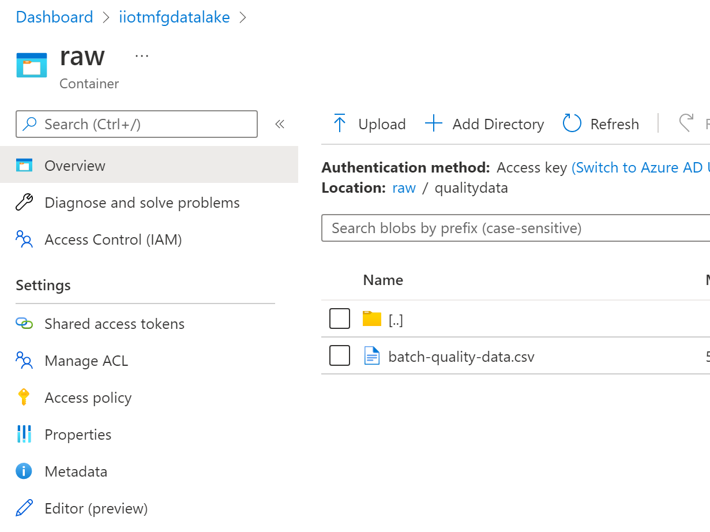
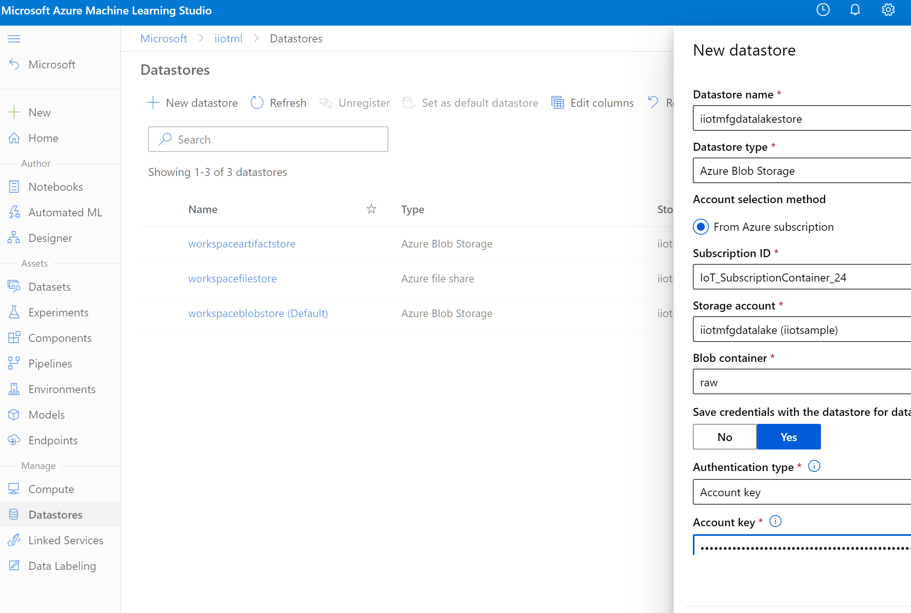

# Exploratory Data Analysis for failure predictions using machine learning

Goal of this sample is to acceleratre deployment of [Industrial IoT Prediction Patterns](TODO). There is no one size fits all solution, as there are many [considerations](TODO), please review them before moving your workload to production.

Exploratory Data Analysis (EDA) is the first step before we build any custom models using machine learning. This is a critical and often complex step where in we normalize & clean the data, understand data distribution, outliers, correlations and assess the data for various hypothesis and experiments. 

## Scenario / Hypothesis

Our scenario is around predicting failures (quality related) based on machine condition. The telemetry data contains a point in time snapshot of all the sensor values, how these values impact failures conditions is logged in a different system. For this sample we will use:

1. Simulated Sensor Data
    - Generated via an IoT Edge Module
    - Contains 40+ different sensor values
    - Contain production batch number 
1. Production Quality Data
    - Contains production batch number
    - Contains quality error code for each batch
    - `1 = Meets quality expecations | 0 = Does not meet quality expectation.`

## High Level Design

## Pre-requisites

- You have [Connectivity Deployment Sample](https://github.com/iotrockstars/iot-iiot/blob/main/1-Connectivity/README.md) working, or have your IIoT data in Data Explorer already.

## Simulate Additional Sensor Data 

- Add new [SimulatedManufacturingSensor module](https://github.com/users/jomit/packages/container/package/simulatedmanufacturingsensors) to the IoT Edge Device created from above sample.

    - In Azure Portal select IoT Hub > IoT Edge > [Your Device] > Set Modules

    - Select Add > IoT Edge Module

        
    
    - Module Name: `SimulatedManufacturingSensors`, Image URI: `ghcr.io/jomit/simulatedmanufacturingsensors:0.0.1-amd64` and click Add

        

    - Click Next and verify that the `upstream` route value is `FROM /messages/* INTO $upstream`

    - Click Next and Create

    - Wait for few seconds and verify that  module is deployed and is sending the logs

        

    - Verify the data in Data Explorer using the query in [VerifySimulatedData.kql](VerifySimulatedData.kql)

        

## Upload production quality data

- Open the data lake created earlier in Azure Portal and upload the `batch-quality-data.csv` file to a folder named `qualitydata`

  

## Create Machine Learning Workspace

*[Machine Learning workspace](https://docs.microsoft.com/en-us/azure/machine-learning/concept-workspace) provides end to end data science lifecycle management services. It also provides a centralized place collaborate on artifacts around machine learning development and deployment.*

- Create a new machine learning workspace and compute instance

    - `az ml workspace create -w iiotml -g iiotsample -l westus2`

    - `az ml computetarget create computeinstance --name jomitdev --vm-size STANDARD_DS3_V2 -w iiotml -g iiotsample`

## Create Datasets

- Open [Machine Learning Studio](https://ml.azure.com/) and select the workspace created above.

- Create new datastore, to connect with the telemetry data lake that we created before.

    
    
- Upload and run below notebooks:
