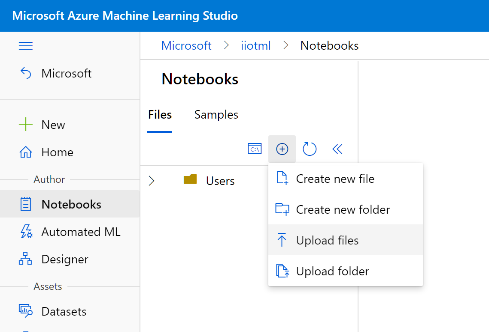
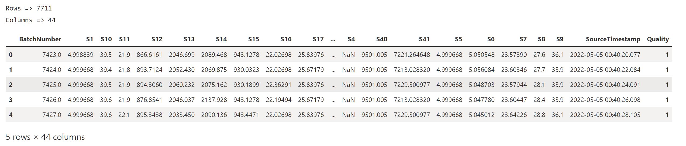
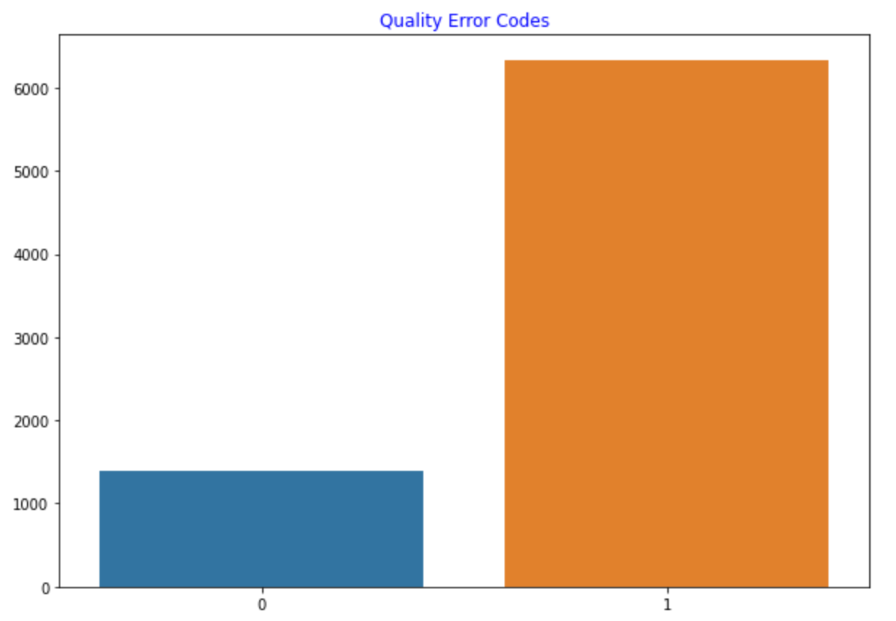
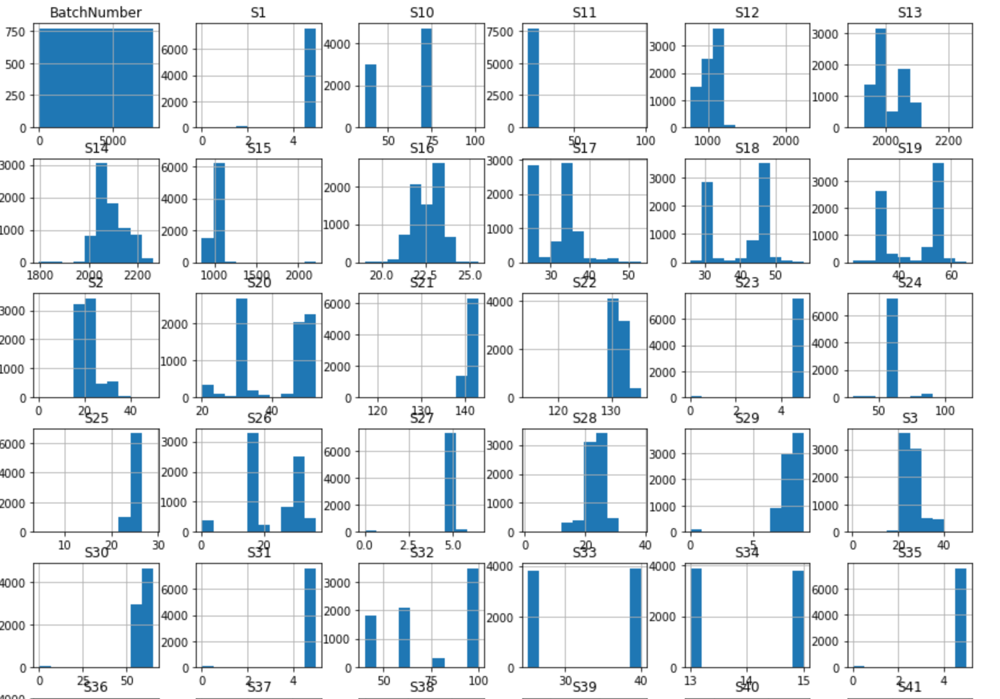
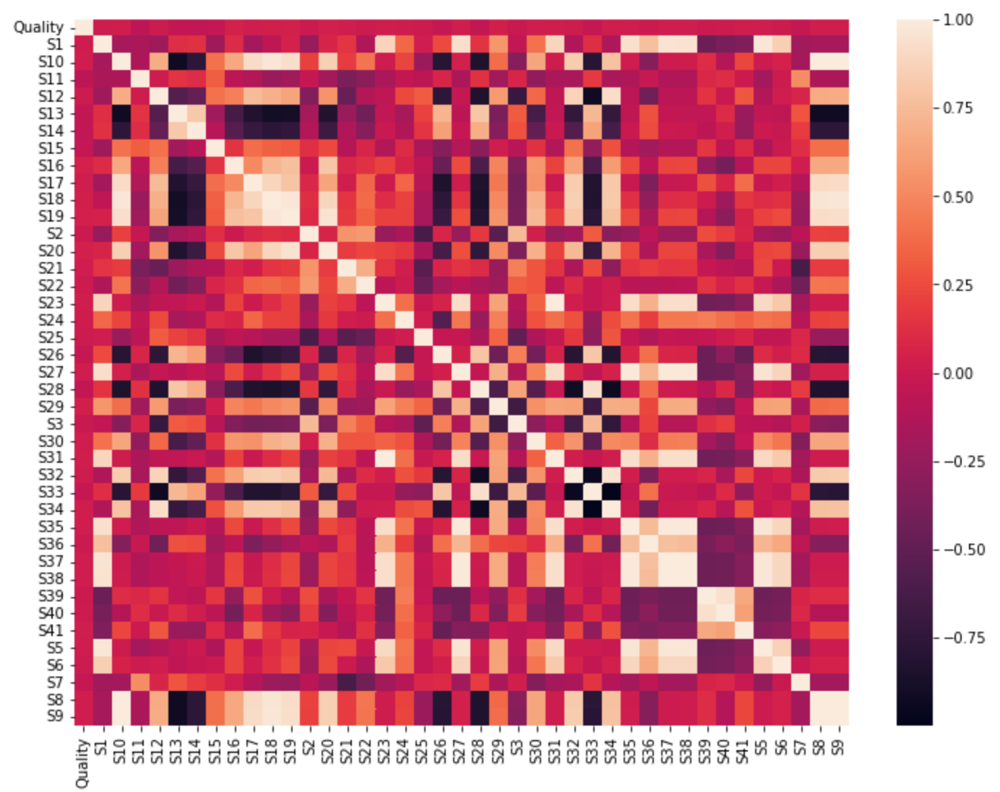
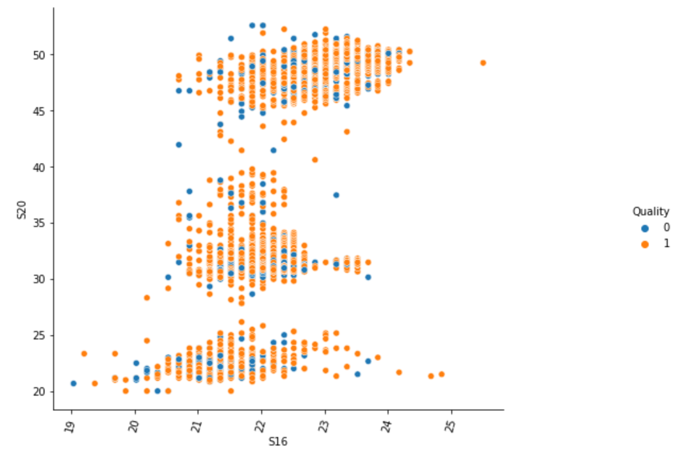
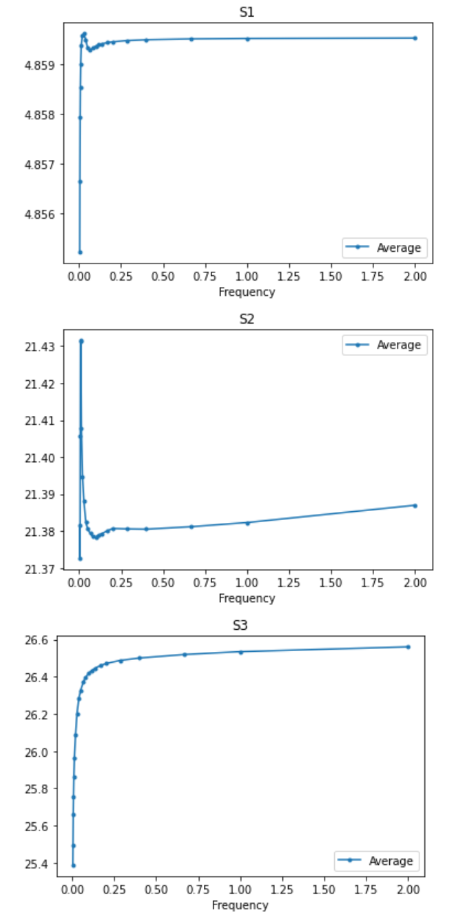
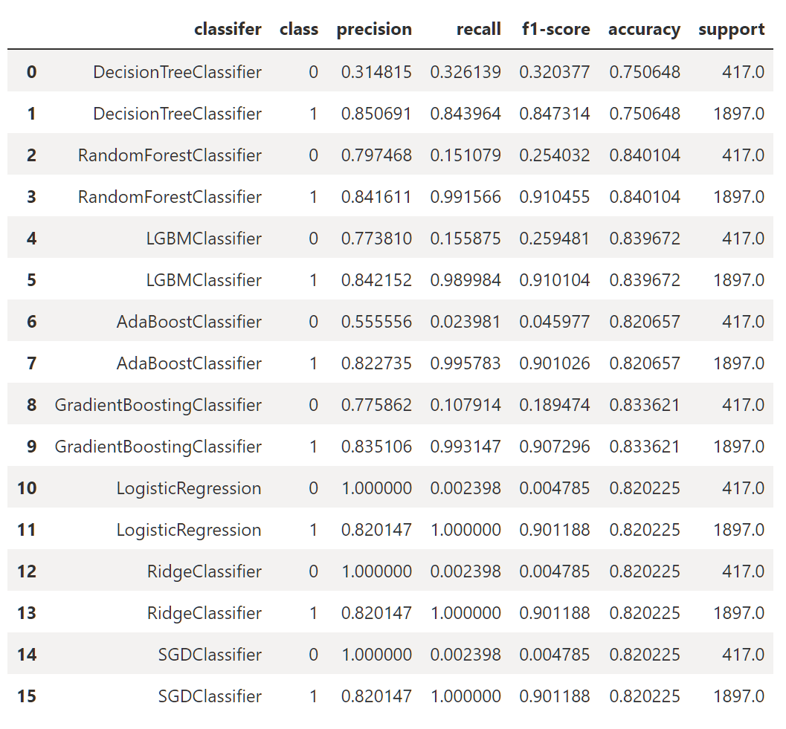

# Exploratory Data Analysis for failure predictions using machine learning

Goal of this sample is to acceleratre deployment of [Industrial IoT Prediction Patterns](https://docs.microsoft.com/en-us/azure/architecture/guide/iiot-patterns/iiot-prediction-patterns). There is no one size fits all solution, as there are many considerations, please review them before moving your workload to production.

Exploratory Data Analysis (EDA) is the first step before we build any custom models using machine learning. This is a critical and often complex step where in we normalize & clean the data, understand data distribution, outliers, correlations and assess the data for various hypothesis and experiments. 

## Scenario / Hypothesis

Our scenario is around predicting failures (quality related) based on machine condition. The telemetry data contains a point in time snapshot of all the sensor values, how these values actually impacted quality failures conditions is logged in a different system. For this sample we will use:

1. Simulated Sensor Data
    - Generated via an IoT Edge Module
    - Contains 40+ different sensor values
    - Contain production batch number 
1. Production Quality Data
    - Contains production batch number
    - Contains quality error code for each batch
    - 1 = Meets quality expectations  |  0 = Does not meet quality expectations.

## High Level Design

## Pre-requisites

- You have [Connectivity Deployment Sample](https://github.com/iotrockstars/iot-iiot/blob/main/1-Connectivity/README.md) working, or have your IIoT data in Data Explorer already.

## Simulate Additional Sensor Data 

- Add new [SimulatedManufacturingSensor module](https://github.com/users/jomit/packages/container/package/simulatedmanufacturingsensors) to the IoT Edge Device created from above sample.

    - In Azure Portal select IoT Hub > IoT Edge > [Your Device] > Set Modules

    - Select Add > IoT Edge Module

        
    
    - Module Name: `SimulatedManufacturingSensors`, Image URI: `ghcr.io/jomit/simulatedmanufacturingsensors:0.0.1-amd64` and click Add

        

    - Click Next and verify that the `upstream` route value is `FROM /messages/* INTO $upstream`

    - Click Next and Create

    - Wait for few seconds and verify that  module is deployed and is sending the logs

        

    - Verify the data in Data Explorer using the query in [VerifySimulatedData.kql](VerifySimulatedData.kql)

        

## Upload production quality data

- Open the data lake created earlier in Azure Portal and upload the `batch-quality-data.csv` file to a folder named `qualitydata`

  

## Create Machine Learning Workspace

*[Machine Learning workspace](https://docs.microsoft.com/en-us/azure/machine-learning/concept-workspace) provides end to end data science lifecycle management services. It also provides a centralized place collaborate on artifacts around machine learning development and deployment.*

- Create a new machine learning workspace

    - `az ml workspace create -w iiotml -g iiotsample -l westus2`

- Create a new compute instance for development. (Compute instances are typically per user so prefix with your name.)

    - `az ml computetarget create computeinstance --name jomitdev --vm-size STANDARD_DS3_V2 -w iiotml -g iiotsample`

- Go to the Notebooks section in Machine Learning Studio portal and upload the files from `notebooks` folder

    

## Create Datastore

- Open [Machine Learning Studio](https://ml.azure.com/) and select the workspace created above.

- Create new datastore, to connect with the telemetry data lake that we created before.

    
    

## Create raw Dataset

- Open and run [1_create_raw_dataset.ipynb](./notebooks/1_create_raw_dataset.ipynb) notebook

    

## Perform Feature Engineering

- Open and run [2_exploratory_analysis_feature_selection.ipynb](./notebooks/2_exploratory_analysis_feature_selection.ipynb) notebook

    

    

    

    

## Perform basic Frequency Analysis

- Open and run [2_frequency_analysis.ipynb](./notebooks/2_frequency_analysis.ipynb) notebook

    

## Build Baseline Model(s)

- Open and run [3_baseline_modeling.ipynb](./notebooks/3_baseline_modeling.ipynb) notebook

    

## Align Business and ML Objectives

For any Machine Learning project to succeed, it’s crucial to tie Machine Learning metrics with the overall business performance. Here's an example of how you may approach this for quality prediction scenarios:

1. Build a baseline of business metrics that you want improve using ML. For example:
    - Number of quality failures
    - Percentange of scrap
    - Additional time spent on quality rework
    - Cost of quality failures
    - Cost of quality rework
1. Select machine learning metrics for model performance based on use case / scenario. For example:
    - "Precision" attempts to answer: What proportion of positive identifications were actually correct?
    - "Recall" attempts to answer : What proportion of actual positives were identified correctly? 
    - For scenarios where cost of wrong prediction is high, choose higher "precision"
    - For scenarios where cost of missing any detection is high, choose higher "recall"
1. Perform A/B testing and quantify business metric improvements and cost impact as shown in below example:
        <table style="float:left">
        <tr><td></td><td>Current</td><td>With ML (precision=50%, recall=90%)</td><td>Cost Impact</td></tr>
        <tr><td>Number of quality failures per year</td><td>100</td><td>25</td><td>cost per quality failure - 75%</td></tr>
        <tr><td>Percentage of scrap</td><td>15%</td><td>9%</td><td>cost of scrap - 6%</td></tr>
        <tr><td>Additional time spent on quality rework</td><td>10%</td><td>2%</td><td>cost of rework - 8%</td></tr>
        <tr><td>...</td><td>...</td><td>...</td><td>...</td></tr>
        </table>