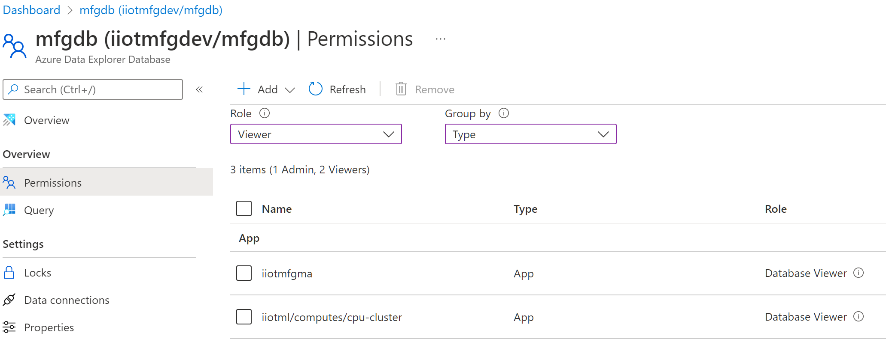
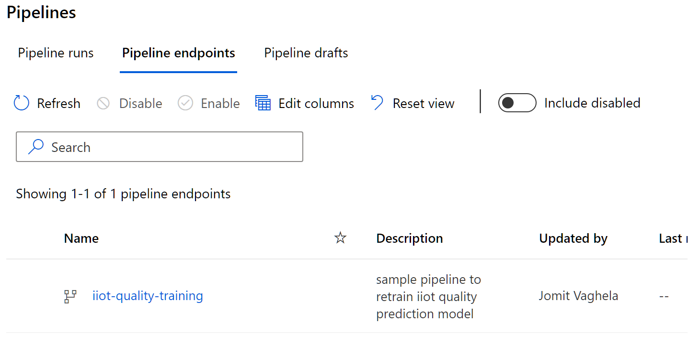
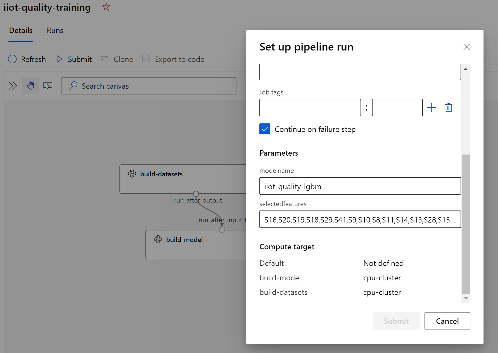
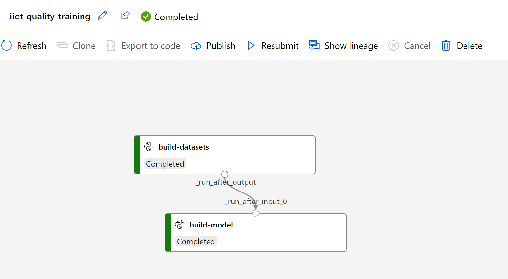
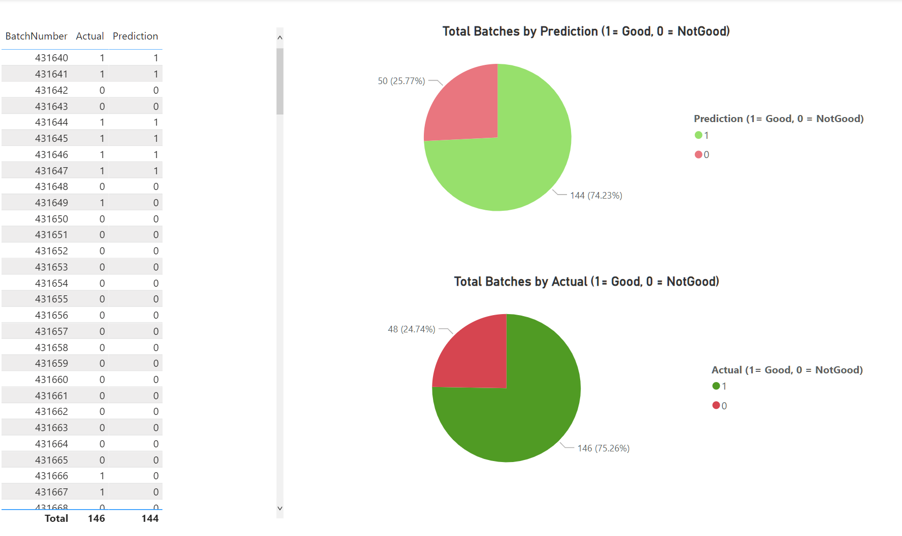

# Operationalizing machine learning models with batch pipelines

Goal of this sample is to acceleratre deployment of [Industrial IoT Prediction Patterns](TODO). There is no one size fits all solution, as there are many [considerations](TODO), please review them before moving your workload to production.

In the previous step we used some of the [Exploratory Data Analysis](../5_ExplorationDataAnalysis/README.md) techniques to select initial features for model and also perform a baseline modeling to understand what algorithms may work well with our dataset. For this sample we will select an algorithm and build an end to end machine learning pipeline to a) train and register a new model and b) run the model on new data and store predictions for reporting. 

## High Level Design

## Pre-requisites

- You have [Exploratory Data Analysis](../5_ExplorationDataAnalysis/README.md) working.

- Create an autoscaled compute cluster with system assigned identity

    - `az ml computetarget create amlcompute --name "cpu-cluster" --max-nodes 2 --vm-size "STANDARD_DS3_V2" --assign-identity '[system]' -w iiotml -g iiotsample`

- Assign Database permissions in Data Explorer to above created 'cpu-cluster' managed identity

    

- Go to the `Notebooks` section in Machine Learning Studio portal and upload the files from `ml-pipelines` folder

## Building Model Training Pipeline

- Open and run [01-build-retrain-pipeline.ipynb](./ml-pipelines/01-build-retrain-pipeline.ipynb) notebook and create a machine learning pipeline that:
    1. Builds and registers train and test datasets.
    2. Builds and registers a new model based on 
    the features provided as a parameter.

    

    

    
    
## Building Model Prediction Pipeline

- Create a folder in the DataLake named `predictionresults`, associated with the Datastore

- Open and run [02-build-prediction-pipeline.ipynb](./ml-pipelines/02-build-prediction-pipeline.ipynb) notebook and create prediction pipeline that:
    1. Gets the registered model 
    1. Gets the latest sensor data from data explorer
    1. Runs the model and saves the prediction results to data lake

    

    

    

## Integrating Model Prediction with Synapse Pipelines

- Create a [Single SQL Database](https://docs.microsoft.com/en-us/azure/azure-sql/database/single-database-create-quickstart?view=azuresql&tabs=azure-portal)

    - Open `Networking` tab and make sure `Allow Azure services and resources to access this server`  is (checked)

- Create a [Synapse Workspace](https://docs.microsoft.com/en-us/azure/synapse-analytics/quickstart-create-workspace) with default settings. 

- Create 3 [Linked Services](https://docs.microsoft.com/en-us/azure/data-factory/concepts-linked-services?tabs=data-factory) in Synapse Workspace connected to:

    

    1. `Data Lake` that the machine learning prediction pipeline uses to store the results.
    1. `SQL Database` created above
    1. `Machine Learning workspace` used above
    
- Create new pipeline using [./synapse-pipelines/QualityPrediction_Pipeline_Template.zip](./synapse-pipelines/QualityPrediction_Pipeline_Template.zip) and select the linked services created above.

    

    

- Trigger the pipeline manually and verify that the prediction results are stored in Data Lake and also added to SQL Database.

    

    

    

- Optionally: You can setup custom triggers to generate predictions on a regular interval. And also view the prediction results directly from the datalake file using Spark pools and Notebooks as shown [here](./synapse-pipelines/Read%20Quality%20Prediction%20CSV.ipynb)

## Reporting Prediction Results

- Open [./powerbi/PredictionResults.pbix](./powerbi/PredictionResults.pbix) file and connect to the SQL Database.

    *Compare Prediction vs. Actual Quality Results*

    

    *See Sensor Values for each bach along with predictions*
    
    

    *Compare specific sensor value against all Good vs. NotGood Results Quality Results*
    
    