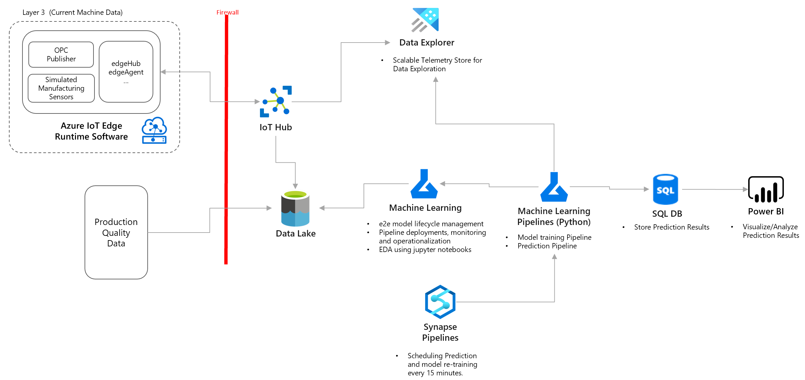
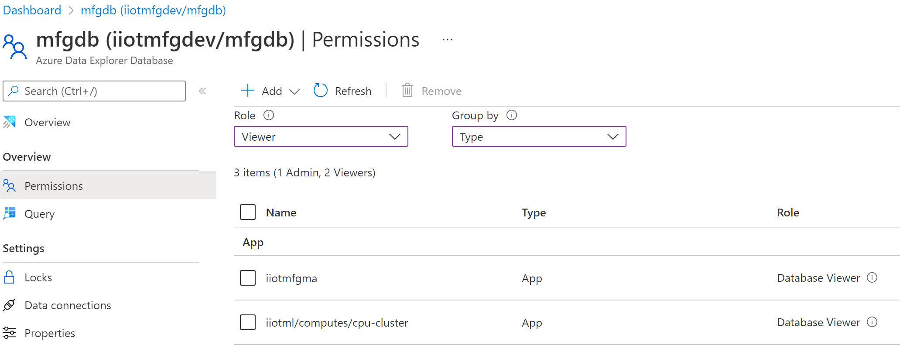
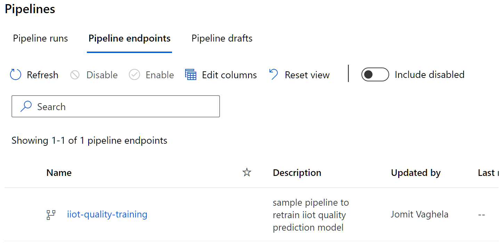
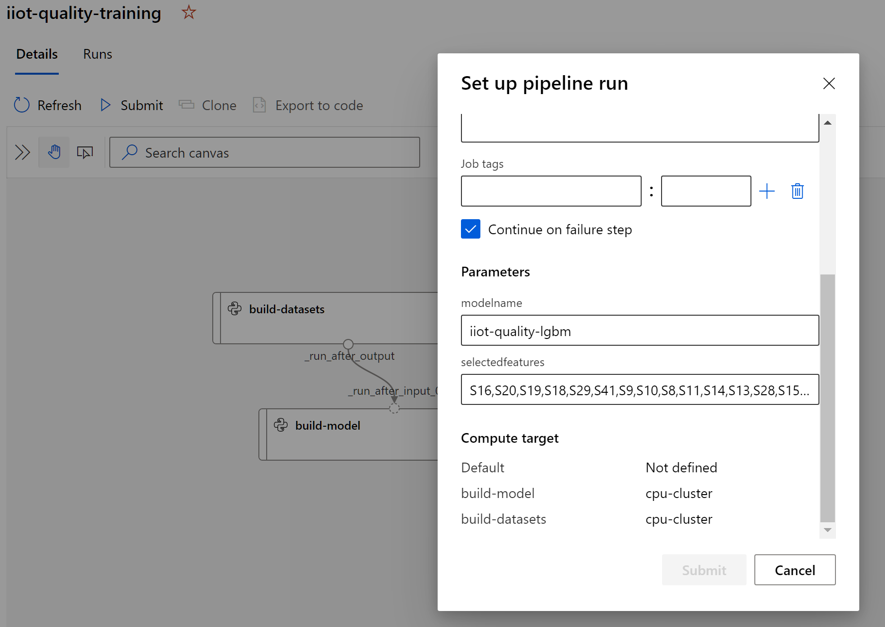

# Operationalizing machine learning based prediction models

Goal of this sample is to acceleratre deployment of [Industrial IoT Prediction Patterns](TODO). There is no one size fits all solution, as there are many [considerations](TODO), please review them before moving your workload to production.

In the previous step we used some of the [Exploratory Data Analysis](../5_ExplorationDataAnalysis/README.md) techniques to select initial features for model and also perform a baseline modeling to understand what algorithms may work well with our dataset. For this sample we will select an algorithm and build an end to end machine learning pipeline to a) train and register a new model and b) run the model on new data and store predictions for reporting. 

## High Level Design

## Pre-requisites

- You have [Exploratory Data Analysis](../5_ExplorationDataAnalysis/README.md) working.

- Create an autoscaled compute cluster with system assigned identity

    - `az ml computetarget create amlcompute --name "cpu-cluster" --max-nodes 2 --vm-size "STANDARD_DS3_V2" --assign-identity '[system]' -w iiotml -g iiotsample`

- Assign Database permissions in Data Explorer to above created 'cpu-cluster' managed identity

    

- Go to the Notebooks section in Machine Learning Studio portal and upload the files from `pipelines` folder
    
    - <IMAGE here> 

## Building Model Training Pipeline

- Open and run [01-build-retrain-pipeline.ipynb](./pipelines/01-build-retrain-pipeline.ipynb) notebook

- Above notebook creates a machine learning pipeline that:
    1. Builds and registers train and test datasets.
    2. Builds and registers a new model based on 
    the features provided as a parameter.

    

    

    
    
## Building Model Prediction Pipeline

- TODO

## Integrating Model Prediction with Synapse Pipelines

- TODO

## Reporting Prediction Results

- TODO