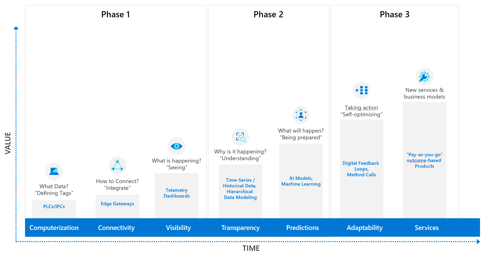

# Industrial IoT Patterns

A modern IIoT solution goes beyond moving existing industrial processes and tools to the cloud. It involves transforming your operations and processes, embracing cloud native services, and leveraging the power of machine learning and the intelligent edge to optimize industrial processes.

There are five key stages for a typical IIoT solution:

Each stage of an IIoT Solution consists of multiple design patterns. Please review the [Industrial IoT Design Patterns doc](TODO) for considerations and when to use these patterns. Below are samples to implement some of these design patterns.

## Getting Started

1. [Connectivity with Industrial Assets](./1_Connectivity/README.md)
1. [Operational Visibility](./2_OperationalVisibility/README.md)
1. [Overall Equipment Effectiveness(OEE) and KPI Calculation Engine](./3_OEECalculationEngine/README.md)
1. [Factory and Supply Chain Digital Twin](./4_FactorySupplyChainTwin/README.md)
1. [Exploratory Data Analysis for failure predictions](./5_ExplorationDataAnalysis/README.md)
1. [Operationalizing machine learning based prediction models](./6_MachineLearningForIIoT/README.md)
1. [Operationalizing image recognition models on the factory floor](./7_ImageRecognitionForIIoT/README.md)
1. [Control system optimization using Deep Reinforcement Learning (DRL)](./8_DeepReinforcementLearningForIIoT/README.md)